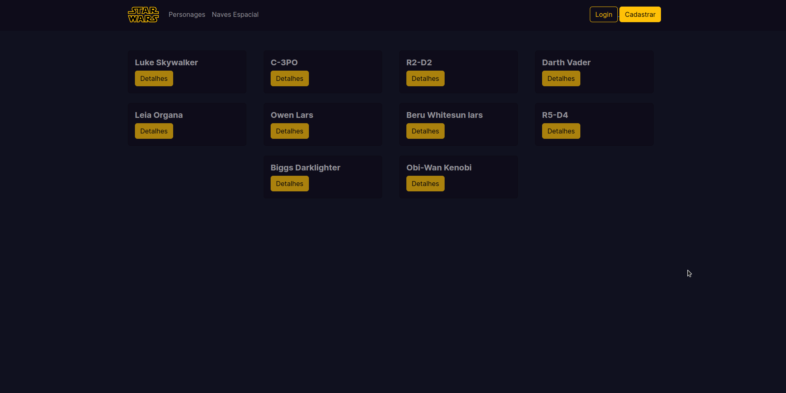

# Star Wars



```bash
# Clonar repositorios
$ git clone https://github.com/manuncorrea/star-wars

# Go into the repository
$ cd star-wars

# Instale dependências para o front-end e execute o servidor
$ npm install
$ npm run dev

```

